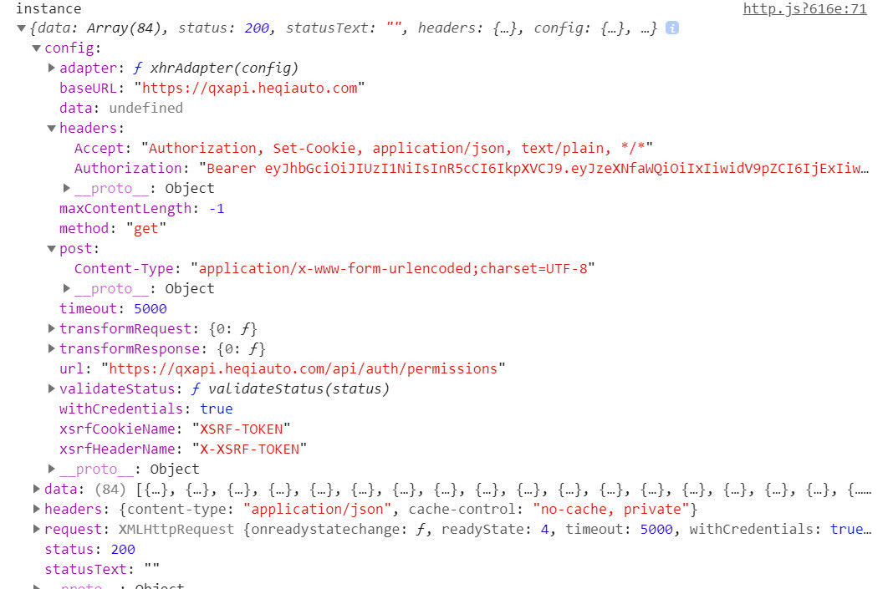

# Axios 封装

* [axios 看云 API](https://www.kancloud.cn/yunye/axios/234845)

* axios 支持的请求方式

```js
  axios.get()
  axios.post()
  axios.delete()

  axios.head()
  axios.put()
  axios.patch()
  axios.options()

// axios.all()
  function getUser(){
    return axios.get("/api/user")
  }

  function getFriend(){
    return axios.post("/api/friend")
  }

  axios.all([getUser(), getFriend()])
  .then(axios.spread((res1, res2) => { 
    // spread展开两个返回的结果, 有先后顺序, 所有请求都完成，才执行这个回调函数
    console.log(res1, res2)
  }))
  .catch() 


// 请求成功时，会执行 .then，失败执行 .catch
// 这两个回调函数都有各自独立的作用域，如果直接在里面访问 this，无法访问到 Vue 实例
// 解决方法1： 箭头函数   .then(() => {})
// 解决方法2： bind(this) .then(function(res) {}.bind(this))
// 
  .then(res => {})
  .catch(err => {})
  
```


## 1. axios 细节

1. 执行顺序： defaults 默认值 -> create() 实例默认值 -> options参数设置值
2. 接收 post参数格式：form-data 格式，所以要用 qs 转换
  - form-data 数据格式：
    - ` www.longwen.com?name=langwen&age=27&token=168 `
  - x-www-form-urlencoded 数据格式：
    - ` { name: langwen, age: 27, token=168 } `

3. axios不能 Vue.use()，只能在每个需要发送请求的组件中引入
  - import 引入axios 之后，修改原型链，将 axios 改写为 Vue 的原型属性
    - ` this.$axios ` 使用 axios
  - 结合 Vuex，封装一个 aciton

```js
// main.js 中引入 axios
  import axios from 'axios'
  
  Vue.prototype.$axios = axios

```


### Vuex 使用 axios

- 即使在 main.js中引入了axios，并改写了原型链，也无法在 store.js中直接使用 $axios命令
  - 组件中发送请求的时候，需要使用 `this.$store.dispatch()` 来触发 actions 里面的方法
- [axios-actions管理请求](/3.vuex/vuex?id=vuex持久化存储)


## 2. class 封装 axios

1. 请求拦截
  - 权限校验，服务器时间戳 + token
  - 参数序列化 queryString

2. 响应拦截
  - 统一捕获接口响应错误
  - 报错后，页面重定向

3. `axios.all([fn1, fn2])` 并发请求


4. 取消请求


```js
import axios from 'axios'
import store from '@/store'

```

### axios 移除拦截器

```js
const interceptor = axios.interceptors.request.use()

axios.interceptors.request.eject(interceptor)

```


## 3. `axios.create()`实例


```js
const instance = axios.create({
  baseURL: '',
  timeout: 5000,
  // cookie可以随着请求发送，不然请求无法携带 cookie
  withCredentials: true,
  headers: {
    Accept: 'Authorization, Set-Cookie, application/json, text/plain, */*',
    post: {
      'Content-Type': 'application/x-www-form-urlencoded'
    }
  }
})

// 创建实例后，修改默认值
instance.defaults.timeout = 3000

// axios 实例 添加拦截器
instance.interceptors.request.use()

```




## 4. 什么是跨域?

- 跨域：指的是浏览器不能执行其他网站的脚本；跨域由浏览器的同源策略造成的，是浏览器对javascript施加的安全限制

- 不同源即跨域
  1. 同域名
  2. 同协议
  3. 同端口

- 同源策略：Same origin policy
  - 是指协议，域名，端口都要相同，其中有一个不同都会产生跨域
  - 是浏览器的一个安全功能，不同源的客户端脚本在没有明确授权的情况下，不能读写对方资源

- 跨域资源的引入是可以的。但是js不能读写加载的内容，以下标签可以跨域:
  - `<script src="">`
  - `<link href="">`
  - ``
  - `<iframe href="">`

| URL | 说明|是否允许通信|
|:-|:-|:-|
| http://www.abc.com/a.js <br><br> http://www.abc.com/b.js | 同一域名下 |协议，域名，端口一致，允许|
| http://www.abc.com/file/a.js <br><br> http://www.abc.com/img/b.js | 同一域名下，不同文件夹 |允许通信|
| http://www.abc.com:3000/a.js <br><br> http://www.abc.com:8080/b.js | 同一域名，不同端口 |跨域，不允许通信|
| http://www.abc.com/a.js <br><br> 21.36.39.32/b.js | 域名和域名对应IP |跨域|
| http://www.abc.com/a.js <br><br> http://admin.abc.com/b.js | 主域名相同，子域名不相同 |跨域|
| http://www.abc.com/a.js <br><br> http://abc.com/b.js | 同一域名，不同二级域名 |跨域|
| http://www.abc.com/a.js <br><br> http://www.def.com/b.js | 不同域名 |跨域|
| http://www.abc.com/a.js <br><br> https://www.abc.com/b.js | 不同协议 |跨域|


### 前端解决跨域

1. vue-cli2.9 代理跨域解决方案:
  - 只能适用于测试阶段，
  - 打包的时候，不会具备服务器功能，不能跨域了，后端解决

```js
// config/ index.js
module.exports = {
  dev: {
    assetsSubDirectory: 'static',
    assetsPublicPath: '/',
    proxyTable: {
      "/api": { // 测试环境
          target: "http://localhost:3000", // 接口域名
          changeOrigin: true, // 是否跨域
          pathRewrite: {
              '^/api': '' // 需要 rewrite重写的
          }
      }
    }
  }
}

```

2. vue-cli4.0 proxy 代理解决方案，只能用在测试阶段

```js
module.exports = {
  lintOnSave: true,
  chainWebpack: config => {
    config.resolve.alias // 设置别名
      .set('@', resolve('src'))
      .set('cps', resolve('src/components'))
  },
  // 打包时不生成.map文件，在浏览器 source下看不到源码
  productionSourceMap: false,
  devServer: {
    // 要代理的网址
    proxy: 'http://localhost:3000'
  }
}

```

3. jsonp

- jsonp跨域请求是GET方式，不能上传文件


4. 当` Content-Type` 为 `application/json` 的时候，会先产生一个 `OPTION` 预请求
  - 把 `Content-Type` 设置为 `application/x-www-form-urlencoded`
  - `axios.defaults.headers.post['Content-Type'] = 'application/x-www-form-urlencoded'`


### 后端解决跨域

- 后端设置 header头，解决跨域问题

```js
  app.all('*', (req, res, next) => {
  res.header('Access-Control-Allow-Origin', '*')
  res.header('Access-Control-Expose-Headers', '*')
  res.header("Access-Control-Allow-Credentials", "true")
  res.header('Access-Control-Allow-Headers', 'X-Requested-With, Content-Type, Access-Token')
  res.header('Access-Control-Allow-Methods','PUT,POST,GET,DELETE,OPTIONS')
  
  next()
})

```

- 常见错误：
  1. 发送请求不通过，不再正式发请求，服务器设置
  - Request header field token is not allowed by Access-Control-Allow-Headers in preflight response


### 取消OPTIONS请求

- 触发 options 请求，主要是因为跨域
- 当 ajax 的请求为非简单请求时，比如跨域，浏览器会进行预检
  1. 发送 OPTIONS 请求到服务器，询问是否允许跨域
  2. 如果响应中允许你的预检中请求的跨域行为，浏览器会进行真正的请求
  3. 否则，会报 405 错误
    - 405一般是前后台约定的请求方式不同，或者后台接口不支持请求类型
    - 如果跨域用的cors的话，让后台加个header就行

- 无法去掉 OPTIONS，但是可以用 Access-Control-Max-Age 缓存
  - 一段时间内不需要重复发 OPTIONS
  - ` Access-Control-Max-Age ` 只对完全相同的 URL 有效，参数不同也无法缓存


### 产生OPTOINS请求的原因

1. 产生了复杂请求
2. 发生了跨域
3. axios默认请求头： `Content-Type: application/json`
  - 这个请求头会出现向服务器请求两次的情况（每个请求都会发送两次，无形加重了服务器的负担）
  - 首先使用 OPTIONS 方法发起一个预请求，判断接口是否能够正常通讯
  - 如果不能就不会发送真正的请求过来；如果测试通讯正常，再发送真正的请求，比如 post，get

4. 跨域并满足以下条件，浏览器就会发送 OPTIONS预请求
  1. 如果 post请求，`Content-Type`不是
    - `application/x-www-form-urlencoded`
    - `multipart/form-data`
    - `ortext/plain` 的请求数据，就会 OPTIONS预请求
    - post发出了options请求。原因在于 `content-type`
    - type=file的控件就是 'multipart/form-data'

  2. 如果post请求使用 `application/xml` 或 `text/xml` 向服务器发送XML有效负载
    - 则请求将被预请求，OPTIONS
    - 不想options请求，却又要验证用户信息该怎么办？用 cookie进行

  3. 即使拿掉请求头里自定义的token，仍然还会在post请求中额外发出options请求
    - 因为不满足简单请求的条件。而 get请求没有这这个情况
    - get请求将 header头里的token拿掉后，get的 options请求消除了


### 如何避免OPTIONS请求

1. 使用代理，避开跨域
2. 将复杂跨域请求更改为简单跨域请求
  - axios 设置拦截器，把请求降低为简单请求
  - 把 `content-type` 设置成 `application/x-www-form-urlencoded`
  - 如果是 post请求, 需要 qs模块转换一下参数为字符串

3. 不使用带自定义配置的 header头
  - 不要在请求中设置自定义 header头，例如：x-pingother，Authorization
  - 请求方法是：GET、HEAD或POST


### http简单请求

1. 请求方法是 GET、HEAD 或者 POST，当请求方法是POST时，Content-Type必须是:
  - `application/x-www-form-urlencoded`
  - `multipart/form-data` 或
  - `text/plain` 中的一个值

2. 请求中没有自定义HTTP头部
3. 自定义头部 header的 content-type
  - 实际的项目里，经常会遇到需要在header头部加上一些token或者其他的用户信息，用来做用户信息的校验
    - 例如 `Authorization = token`


### http复杂请求

- [mdn-Cross-Origin Resource Sharing 跨域资源共享](https://developer.mozilla.org/zh-CN/docs/Glossary/CORS)
- [mdn-CORS HTTP访问控制](https://developer.mozilla.org/zh-CN/docs/Web/HTTP/Access_control_CORS)
- 在正式通信之前，增加一次HTTP查询请求，称为“预检”请求（preflight）。预检请求为 OPTIONS请求
- 自定义的 header字段，例如 `Authorization`
- ajax 遵循同源策略（协议、域名、端口必须一致），若突破该限制，会产生跨域行为

- 前端发起请求时 OPTIONS请求没有办法去除，那么可以考虑从后台拦截器进行改造
  - 如果拦截到的请求不是项目中常规的GET或者POST请求，则该拦截器直接放行


## 5. 什么是 axios

- 一个基于 Promise 的 HTTP 库，支持 Promise API

- 用于浏览器和 Nodejs 的服务端通信库
  - 浏览器中创建 XMLHttpRequests
  - node.js 创建 http 请求

- axios的好处：
  * 拦截请求和响应
  * 转换请求数据和响应数据
  * 取消请求
  * 自动转换 JSON 数据
  * 客户端支持防御 XSRF


## JSONP

```js
{
  url: 'https://sp0.baidu.com/5a1Fazu8AA54nxGko9WTAnF6hhy/su'
  params:{ wd:'love' },
  jsonp:'cb'
}

if(ev.keyCode == 13){
  window.location.href="https://www.baidu.com/s?wd="+ this.text
}
```
